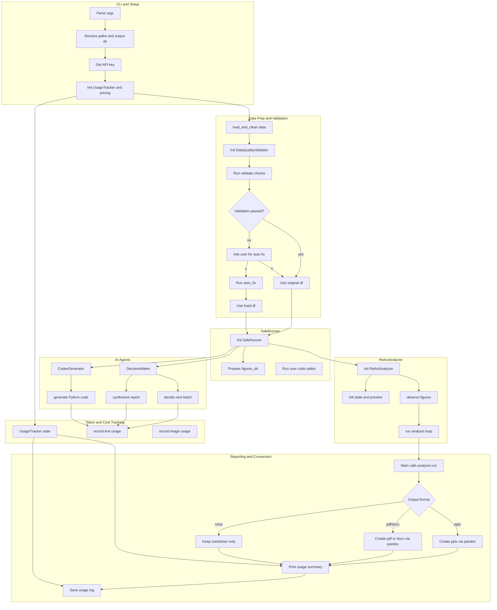
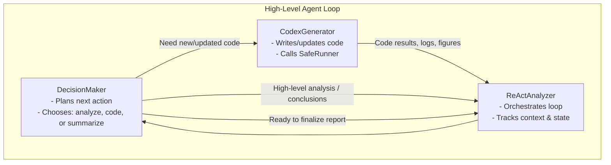

# Tecnun‑IAthon ResearchAssistant

An AI‑powered data exploration and reporting tool designed for the Tecnun‑IAthon.  
Give it a CSV/Excel file, and it will:

- Validate and clean the data.
- Iteratively explore it using AI “agents”.
- Generate multiple visualizations.
- Run statistical tests.
- Produce a comprehensive Markdown report (optionally converted to PDF, DOCX, or PPTX).
- Track and summarize OpenAI token usage and cost.

This repository contains several files. The workhorse is AgentResearchAssitant.
md_to_ppt.py is an attempt (that works) that converts Markdown to Powerpoint. It was written to decrease the complexity of the AgentResearchAssitant
RetrieveImage.py is an utility function that illustrates how to download an image from the internet using a description. In teresting to illustrate the reports.

---

## Features

- **Command‑line tool**: simple CLI interface for running full analyses.
- **Data loading & cleaning**:
  - Reads CSV/Excel into a Pandas `DataFrame`.
  - Drops low‑information columns and constant columns.
  - Identifies numeric vs. categorical features.
- **Data Quality Validation**:
  - Checks for:
    - Synthetic patterns (too‑perfect uniform distributions, etc.).
    - Outliers.
    - Domain constraints (ages, percentages, times).
    - Temporal logic issues.
  - Prints human‑readable summary (errors, warnings, info).
  - Optionally auto‑fixes some issues (negative times, invalid ages, etc.).
- **Safe execution sandbox (SafeRunner)**:
  - Executes AI‑generated Python code safely with:
    - Pre‑loaded `df`, `num_features`, `cat_features`.
    - Access to `numpy`, `pandas`, `scipy.stats`, `matplotlib`, `seaborn`, `plotly`.
    - A dedicated `figures/` directory.
  - Blocks file‑reading functions (`pd.read_csv`, etc.).
  - Rewrites `plt.savefig(...)` calls so all plots land in `figures/`.
  - Ensures at least one `.png` is created or raises an error.
- **AI “agents”**:
  - **DecisionMaker**: plans the analysis steps and synthesizes the final report.
  - **CodexGenerator**: generates robust Python code for analysis and plotting.
  - **ReActAnalyzer**: orchestrates the iterative loop between agents and the SafeRunner.
- **ReAct‑style analysis loop**:
  - Repeatedly:
    - Plans the next analysis step.
    - Generates and runs code.
    - Observes results and errors.
  - Stops when the analysis is complete and builds a final Markdown report.
- **Report generation & conversion**:
  - Saves `report.md` in the output directory.
  - Optionally converts to:
    - PPTX (via `pandoc`, with optional custom templates if available).
    - PDF or DOCX.
- **OpenAI cost tracking**:
  - Live pricing fetch (with caching and robust fallbacks).
  - Tracks tokens per model.
  - Prints a detailed cost summary at the end.
  - Saves a `token_usage.log` file.

---

## High‑Level Architecture

### Big‑picture explanation

At a high level, the program does this:

1. **CLI + Setup**
   - Reads command-line arguments (input file, output path, format, custom prompt, API key).
   - Creates an output directory.
   - Initializes a **UsageTracker** that:
     - Fetches OpenAI pricing (live web scrape → cache → fallback table).
     - Tracks tokens/cost across models.

2. **Data Loading + Validation**
   - `load_and_clean()` reads CSV/Excel into a DataFrame, drops bad columns, splits numeric vs categorical features.
   - **DataQualityValidator**:
     - Runs checks for synthetic patterns, outliers, domain constraints (ages, percentages, times), temporal logic.
     - Prints a human-readable summary (errors/warnings/info).
     - Optionally auto-fixes some issues (negative times, invalid ages).

3. **Safe Execution Environment**
   - **SafeRunner** holds the cleaned (or fixed) DataFrame.
   - It executes generated Python code with:
     - A safe global environment (df, plotting libraries, stats, np/pd, FIGURES_DIR).
     - Blocked file-read calls (no `pd.read_csv`, etc.).
     - Rewritten `plt.savefig(...)` calls so all plots land in an output `figures/` folder.
     - A requirement that at least one `.png` is saved, or it raises an error.

4. **AI “Agents”**
   - **DecisionMaker** (planning & reporting agent):
     - Uses OpenAI (chat/completions) to:
       - Plan batch analyses over several steps (ReAct-style loop).
       - Synthesize a final Markdown report that references the actual figures created.
     - Logs token usage via **UsageTracker**.
   - **CodexGenerator** (code-writing agent):
     - Uses OpenAI (responses API) to generate Python code blocks that:
       - Operate on the in-memory `df`.
       - Create multiple plots per batch and save them to `FIGURES_DIR`.
       - Obey robustness rules (check dtypes, handle NaNs, etc.).
     - Logs token usage via **UsageTracker**.

5. **ReActAnalyzer – Orchestrator**
   - **ReActAnalyzer** coordinates the loop:
     - Maintains observations, analysis log, error history, and a data preview.
     - For up to `max_steps`:
       - Asks **DecisionMaker** for the next “batch analysis” plan (or “STOP”).
       - Asks **CodexGenerator** to turn that plan (plus any recent errors) into Python code.
       - Runs that code with **SafeRunner**, then:
         - Records success/failure, updates observations and logs.
     - At the end, asks **DecisionMaker** to synthesize the final Markdown report.
     - Saves `report.md` in the output directory.

6. **Output Conversion + Cost Summary**
   - If requested (`--format`), uses `pandoc` to convert `report.md` to PDF/DOCX or PPTX, with:
     - Optional custom PPTX styling/template (if helper functions are available).
   - Finally, **UsageTracker**:
     - Prints a detailed cost summary by model.
     - Saves `token_usage.log` in the output directory.

---

### End‑to‑end pipeline (Mermaid)



#### How to read this diagram

- **Top → bottom**: high-level pipeline: CLI → data loading & validation → safe runner → AI agents → ReAct loop → outputs & cost summary.
- **Subgraphs**:
  - **CLI**: how the tool is configured by the user.
  - **DATA**: how the DataFrame is cleaned and checked.
  - **SAFE**: sandbox for executing model-generated code.
  - **AGENTS**: Decider (plans + report) and Coder (code generation).
  - **REACT**: orchestrator that iteratively uses the agents + SafeRunner.
  - **OUTPUT**: report creation and optional pandoc conversion.
  - **TRACK**: central token/cost tracker used by all model calls.

---

## Agents cheat‑sheet (for README overview)

This diagram focuses only on the three main agents and their back‑and‑forth.

- **DecisionMaker**: decides *what* to do next (analysis step vs. code step vs. summarization).
- **CodexGenerator**: writes and updates Python code to run against the data.
- **ReActAnalyzer**: orchestrates the loop, feeding observations/results back into DecisionMaker and CodexGenerator until the analysis is done.



Key ideas:

- **ReActAnalyzer** is the conductor:
  - Calls **DecisionMaker** to decide the next move.
  - Calls **CodexGenerator** to get code for the planned step.
  - Observes results/errors and updates context.
- **DecisionMaker** is the strategist (planning & final report).
- **CodexGenerator** is the coder (analysis & visualization code).

---

## Installation

1. **Clone the repository**

```bash
git clone https://github.com/arubio2/CleanCode.git
cd CleanCode
```

2. **Create and activate a virtual environment (recommended)**

```bash
python -m venv .venv
source .venv/bin/activate      # On Windows: .venv\Scripts\activate
```

3. **Install dependencies**

At minimum:

```bash
pip install -r requirements.txt
```

If you don’t have a `requirements.txt`, you’ll need (exact versions are up to you):

- `pandas`
- `numpy`
- `scipy`
- `matplotlib`
- `seaborn`
- `plotly`
- `openai`
- `requests` and `beautifulsoup4` (optional, for live pricing; falls back if missing)
- `python-pptx` (optional, for PowerPoint enhancements)

Pandoc is required for PDF/DOCX/PPTX conversion:

- Install from: <https://pandoc.org/install.html>

---

## Configuration

### OpenAI API key

The script expects an OpenAI API key via:

- Environment variable:

  ```bash
  export OPENAI_API_KEY="sk-..."
  ```

- Or a CLI argument (if implemented in your CLI wrapper):

  ```bash
  python AgentResearchAssitant.py --api-key "sk-..." ...
  ```

`get_api_key()` internally resolves the key from CLI or environment.

---

## Usage

The main entry point is `AgentResearchAssitant.py` (the ResearchAssistant script).

A typical run:

```bash
python AgentResearchAssitant.py \
  --input path/to/data.csv \
  --output-dir results/run1 \
  --format pptx \
  --max-steps 6 \
  --verbose
```

While exact flags may vary slightly, the flow is:

1. **CLI + Setup**
   - Parse arguments: input file, output directory, report format, custom prompt (if any), API key.
   - Initialize `UsageTracker` (with live pricing fetch → cache → fallback).

2. **Data loading & validation**
   - Use `load_and_clean()` to load CSV/Excel into a `DataFrame`.
   - Run `DataQualityValidator.validate()`:
     - Print checks and issues.
     - Optionally ask whether to auto‑fix certain problems.
   - Proceed with original or fixed `df`.

3. **SafeRunner initialization**
   - Create `SafeRunner(df, num_features, cat_features, output_dir, verbose=...)`.
   - Prepare a fresh `figures/` subdirectory.

4. **ReActAnalyzer loop**
   - Initialize `ReActAnalyzer` with:
     - The SafeRunner.
     - The `UsageTracker`.
     - Initial data preview and state.
   - For each step (up to `max_steps`):
     - Ask **DecisionMaker** for the next plan (or STOP).
     - Ask **CodexGenerator** to generate Python code for that plan (taking into account recent errors).
     - Run the code in `SafeRunner`.
     - Observe generated figures and any errors; update the analysis log.

5. **Final report & conversion**
   - Ask **DecisionMaker** to synthesize a final Markdown report (references real figures in `figures/`).
   - Save `report.md` in `output_dir`.
   - If `--format` is:
     - `pptx`: use `pandoc` (and optional helper functions) to generate a PowerPoint.
     - `pdf` or `docx`: use `pandoc` to convert the markdown.
     - Not given: keep markdown only.

6. **Usage summary**
   - Print a detailed token & cost summary via `UsageTracker.print_summary()`.
   - Save `token_usage.log` in the output directory via `UsageTracker.save_log()`.

Output structure (example):

```text
results/run1/
  report.md
  report.pdf / report.docx / report.pptx  # if requested
  figures/
    fig_001.png
    fig_002.png
    ...
  token_usage.log
```

---

## Components (Code Overview)

### `UsageTracker`

- Tracks token usage per model.
- Attempts to fetch live pricing from `https://openai.com/api/pricing/`:
  - If successful: caches data locally (`~/.cache/iathlon/openai_pricing.json`).
  - If not: loads from cache.
  - If both fail: uses a **fallback pricing table** (updated January 2025).
- Supports both text models and image models (DALL‑E 2/3).
- Computes and prints per‑model and total cost.

### `SafeRunner`

- Holds:
  - `df` (copy for each execution).
  - `num_features`, `cat_features`.
  - `figures_dir` (inside the chosen output directory).
- Provides a `run(code: str)` method that:
  - Strips triple backticks from code blocks if present.
  - Blocks disallowed file reads (`pd.read_*`).
  - Injects a safe global environment (df, plotting libs, stats, etc.).
  - Rewrites `plt.savefig("plot.png")` → `plt.savefig(os.path.join(FIGURES_DIR, "plot.png"))`.
  - Runs `exec` on the code and checks that at least one `.png` exists in `figures_dir`.

### `DataQualityValidator`

- Takes:
  - `df`, `num_features`, `cat_features`.
- Methods:
  - `validate()` runs:
    - `_check_synthetic_patterns()`
    - `_check_outliers()`
    - `_check_domain_constraints()`
    - `_check_temporal_logic()`
  - Tracks issues and possible corrections.
  - Can offer/perform automatic fixes for certain issues.
- Prints a concise, readable validation report.

### AI Agents

- **DecisionMaker**
  - Uses OpenAI Chat / Completions API.
  - Given:
    - Data preview.
    - Analysis log.
    - Error history.
    - Available figures.
  - Produces:
    - Next “batch analysis” instructions.
    - Final Markdown report when asked to finish.

- **CodexGenerator**
  - Uses OpenAI Responses API to produce Python code.
  - Constraints:
    - Operate on in-memory `df` only.
    - Use `num_features` and `cat_features` sensibly.
    - Save multiple plots to `FIGURES_DIR`.
    - Handle NaNs, dtypes, and common pitfalls robustly.

- **ReActAnalyzer**
  - Maintains global loop state:
    - Step counter.
    - Observations and figures.
    - Error history.
    - Text log.
  - At each iteration:
    - Calls `DecisionMaker` → plan.
    - Calls `CodexGenerator` → code.
    - Calls `SafeRunner.run(code)` → figures and success/failure.
  - At the end:
    - Calls `DecisionMaker` to write the final Markdown report.

---

## Hackathon notes (Tecnun‑IAthon)

- This repository is meant as a **starting point**:
  - You are encouraged to:
    - Modify prompting strategies.
    - Add new agents (e.g., a “HypothesisTester”, “DashboardBuilder”, etc.).
    - Extend validation checks or auto‑fix logic.
    - Customize the report structure and templates.
    - Improve cost control and budgeting.
- When experimenting:
  - Be mindful of **token usage** and **model selection**.
  - Use `gpt-4o-mini` / smaller models when possible.
  - Check `token_usage.log` after each run.

---

## License

Add your chosen license here (e.g., MIT, Apache‑2.0).
