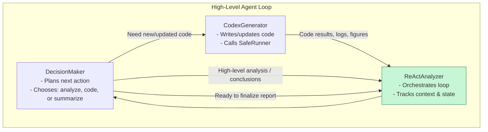

### Big-picture explanation

At a high level, the program does this:

1. **CLI + Setup**
   - Reads command-line arguments (input file, output path, format, custom prompt, API key).
   - Creates an output directory.
   - Initializes a **UsageTracker** that:
     - Fetches OpenAI pricing (live web scrape → cache → fallback table).
     - Tracks tokens/cost across models.

2. **Data Loading + Validation**
   - `load_and_clean()` reads CSV/Excel into a DataFrame, drops bad columns, splits numeric vs categorical features.
   - **DataQualityValidator**:
     - Runs checks for synthetic patterns, outliers, domain constraints (ages, percentages, times), temporal logic.
     - Prints a human-readable summary (errors/warnings/info).
     - Optionally auto-fixes some issues (negative times, invalid ages).

3. **Safe Execution Environment**
   - **SafeRunner** holds the cleaned (or fixed) DataFrame.
   - It executes generated Python code with:
     - A safe global environment (df, plotting libraries, stats, np/pd, FIGURES_DIR).
     - Blocked file-read calls (no `pd.read_csv`, etc.).
     - Rewritten `plt.savefig(...)` calls so all plots land in an output `figures/` folder.
     - A requirement that at least one `.png` is saved, or it raises an error.

4. **AI “Agents”**
   - **DecisionMaker** (planning & reporting agent):
     - Uses OpenAI (chat/completions) to:
       - Plan batch analyses over several steps (ReAct-style loop).
       - Synthesize a final Markdown report that references the actual figures created.
     - Logs token usage via **UsageTracker**.
   - **CodexGenerator** (code-writing agent):
     - Uses OpenAI (responses API) to generate Python code blocks that:
       - Operate on the in-memory `df`.
       - Create multiple plots per batch and save them to `FIGURES_DIR`.
       - Obey robustness rules (check dtypes, handle NaNs, etc.).
     - Logs token usage via **UsageTracker**.

5. **ReActAnalyzer – Orchestrator**
   - **ReActAnalyzer** coordinates the loop:
     - Maintains observations, analysis log, error history, and a data preview.
     - For up to `max_steps`:
       - Asks **DecisionMaker** for the next “batch analysis” plan (or “STOP”).
       - Asks **CodexGenerator** to turn that plan (plus any recent errors) into Python code.
       - Runs that code with **SafeRunner**, then:
         - Records success/failure, updates observations and logs.
     - At the end, asks **DecisionMaker** to synthesize the final Markdown report.
     - Saves `report.md` in the output directory.

6. **Output Conversion + Cost Summary**
   - If requested (`--format`), uses `pandoc` to convert `report.md` to PDF/DOCX or PPTX, with:
     - Optional custom PPTX styling/template (if helper functions are available).
   - Finally, **UsageTracker**:
     - Prints a detailed cost summary by model.
     - Saves `token_usage.log` in the output directory.

---

### How to read this diagram

- **Top → bottom**: high-level pipeline: CLI → data loading & validation → safe runner → AI agents → ReAct loop → outputs & cost summary.
- **Subgraphs**:
  - **CLI**: how the tool is configured by the user.
  - **DATA**: how the DataFrame is cleaned and checked.
  - **SAFE**: sandbox for executing model-generated code.
  - **AGENTS**: Decider (plans + report) and Coder (code generation).
  - **REACT**: orchestrator that iteratively uses the agents + SafeRunner.
  - **OUTPUT**: report creation and optional pandoc conversion.
  - **TRACK**: central token/cost tracker used by all model calls.

## Illustration on how the three main agents interact

- **DecisionMaker**: decides *what* to do next (analysis step vs. code step vs. summarization).
- **CodexGenerator**: writes and updates Python code to run against the data.
- **ReActAnalyzer**: orchestrates the loop, feeding observations/results back into DecisionMaker and CodexGenerator until the analysis is done.

Below is a minimal flowchart showing their back‑and‑forth:

Key points in the diagram:

- **ReActAnalyzer** sits in the middle, repeatedly:
  - calling **DecisionMaker** to decide the next move,
  - asking **CodexGenerator** for new/updated code when needed,
  - aggregating outputs and deciding when the loop is complete.
- **DecisionMaker** is the strategist; **CodexGenerator** is the coder; **ReActAnalyzer** is the conductor.
